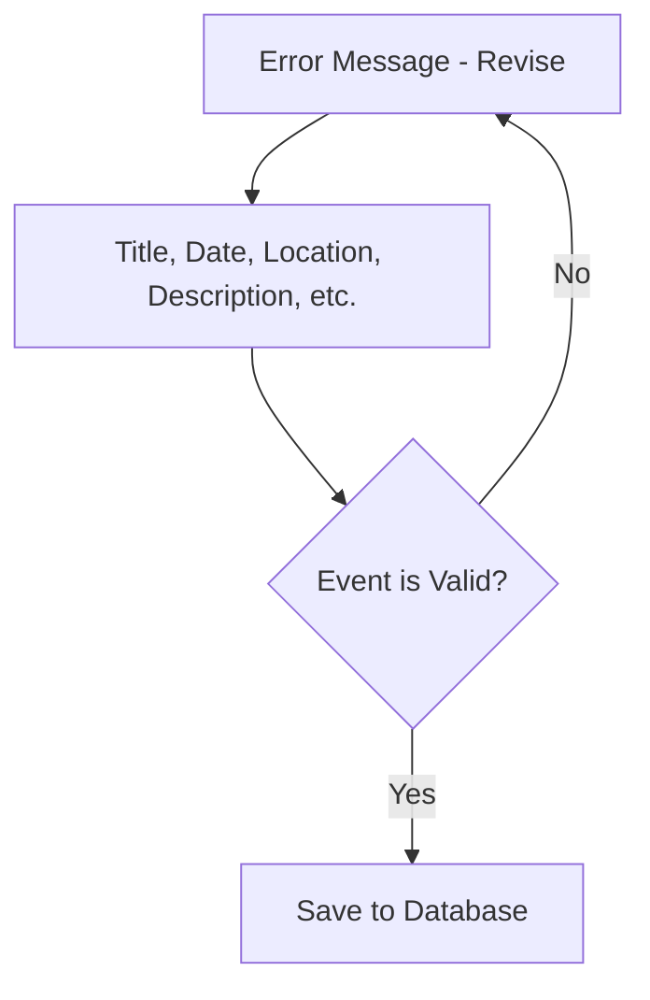
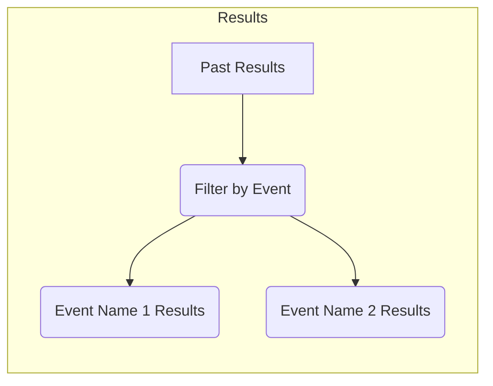
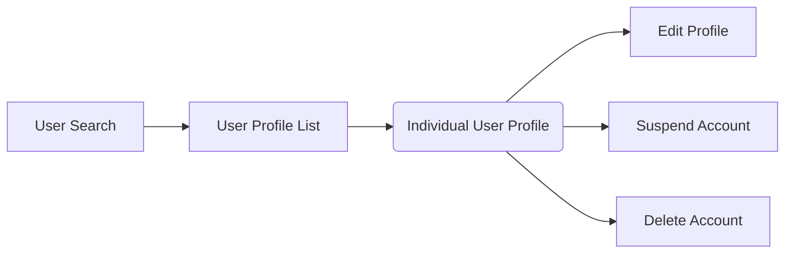

# Trail-Running-Website
## User Interface (Runners)
### Upcoming Events
```mermaid
graph LR
    A[Upcoming Events] --> B(Event 1 Details)
    A --> C(Event 2 Details)
    A --> D(More Events [Link]) 
```
### Add Events

### Past Results

## Administrator Interface
### Add Events

### Manage User Profiles

